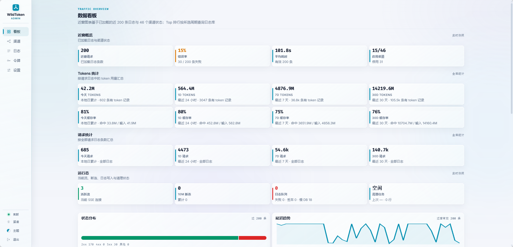
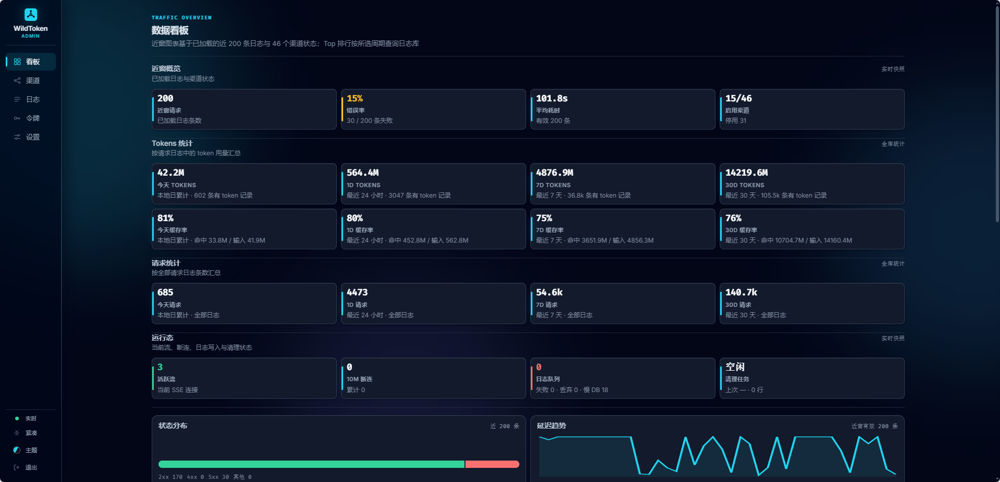
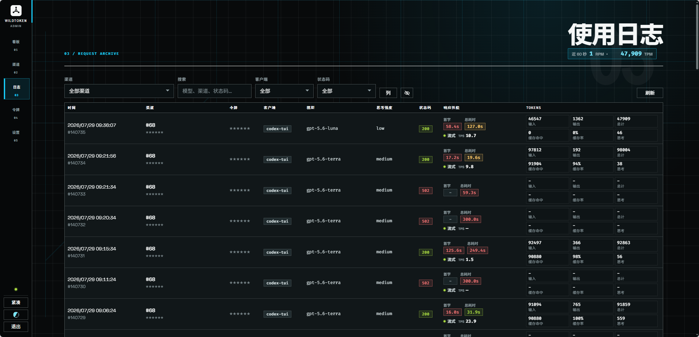
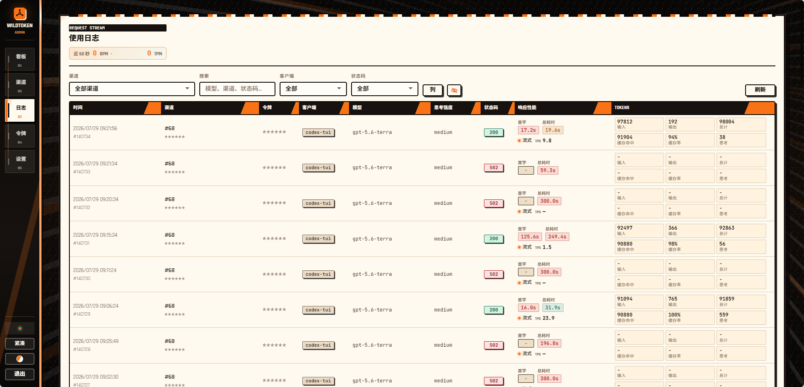

# WildToken

Language: English | [Simplified Chinese](README.zh-CN.md)

WildToken is a self-hosted LLM API aggregation gateway written in Rust. It
exposes OpenAI-compatible `/v1/*` endpoints and an Anthropic-compatible
`/v1/messages` endpoint, then routes each downstream request to the right
upstream channel by explicit channel hints, model rules, priority, weight, and
runtime health.

Use it when you want one stable API entrypoint for multiple LLM providers,
private provider keys, per-client downstream tokens, request observability, and
an admin console for day-to-day operations.

## Highlights

- OpenAI-compatible gateway: forward Chat Completions, Responses, model-list,
  streaming, and other `/v1/*` requests through one local endpoint.
- Anthropic Messages compatibility: `POST /v1/messages` accepts standard
  `x-api-key` and `anthropic-version` headers and forwards them to
  Anthropic-compatible upstreams.
- Multi-upstream aggregation: configure channels with base URLs, provider API
  keys, model names, model mappings, model prefixes, and per-channel headers.
- Routing controls: select by `X-WildToken-Upstream`, `?upstream=`, exact model
  mappings, model names, prefixes, priority layers, weighted random choice, and
  automatic health-based effective weight.
- Retry and failover policy: failed automatic routes can reselect another
  channel, while same-channel retries respect the configured delay.
- Downstream token management: create client-facing API tokens in the admin
  console; full token values are shown once, and the database stores only
  hashes plus irreversible previews.
- Admin dashboard: inspect channel status, request logs, token usage, top
  models/channels, latency, runtime metrics, and request/response snapshots.
- Channel tools: fetch model lists, test connectivity, test a selected model,
  and query new-api/sub2api-style balances from the console.
- Body retention controls: keep metadata while pruning old request/response
  bodies to limit SQLite growth.
- Theme packs: optional CSS-only admin themes under `themes/`, loaded without
  executing theme JavaScript.
- Desktop-friendly release mode: Windows builds can run from the system tray;
  Linux, macOS, Docker, and source builds run as normal services.

## Screenshots

Dashboard with the built-in light and dark themes:

| Light | Dark |
| --- | --- |
|  |  |

Request log page rendered by two CSS-only theme packs from [`themes/`](themes/):

| Ark | Bleach |
| --- | --- |
|  |  |

## Quick Start

### Docker Compose

Docker Compose is the easiest way to run WildToken as a local service.

```bash
cp .env.example .env
# Edit .env and set ADMIN_TOKEN to a unique 8-256 byte printable ASCII value.
docker compose up -d --build
curl -fsS http://127.0.0.1:3100/health
```

Open the admin console:

```text
http://127.0.0.1:3100/admin
```

The Compose file stores SQLite data in the `wildtoken-data` volume and publishes
port `3100`. It also mounts `./themes` read-only into the container so theme
changes do not require an image rebuild.

For a brand-new database listening beyond localhost, WildToken refuses to start
unless `ADMIN_TOKEN` is explicitly set. The token must be 8-256 bytes, printable
ASCII, contain no spaces, and not be `change-me`.

### From Source

Requirements:

- Rust toolchain compatible with the repository lockfile
- SQLite support through `sqlx`

Run locally:

```bash
cp .env.example .env
# Optional for localhost-only first boot, required before exposing the service.
ADMIN_TOKEN=replace-with-a-long-random-token cargo run
```

By default, source runs bind to `127.0.0.1:3100` and use
`sqlite:wildtoken.db?mode=rwc`.

### Windows Desktop

Release archives include `wildtoken.exe`. Double-clicking it starts WildToken in
system-tray mode:

- left-click or double-click the tray icon to open the admin console
- use the tray menu to open the console or quit
- logs are written to `wildtoken.log` in the working directory
- set `WILDTOKEN_NO_TRAY=1`, or pass `--no-tray` / `--console`, for service or CI
  usage without the tray UI

Linux, macOS, and Docker builds keep the foreground service behavior.

## First Configuration

1. Open `/admin` and log in with the Admin Token.
2. Create an upstream channel with its base URL, provider API key, models, model
   mappings, priority, weight, and optional header overrides.
3. Use the channel test or model test action to verify provider connectivity.
4. Create a downstream token on the Tokens page.
5. Call WildToken through `http://127.0.0.1:3100/v1/...` using the downstream
   token instead of the provider key.

Provider API keys stay on the server-side channel records. Clients only need
their downstream WildToken token.

## API Examples

OpenAI-compatible Chat Completions:

```bash
curl http://127.0.0.1:3100/v1/chat/completions \
  -H 'Content-Type: application/json' \
  -H 'Authorization: Bearer <DOWNSTREAM_TOKEN>' \
  -d '{
    "model": "gpt-4o-mini",
    "messages": [{"role": "user", "content": "hello"}]
  }'
```

Anthropic-compatible Messages:

```bash
curl http://127.0.0.1:3100/v1/messages \
  -H 'Content-Type: application/json' \
  -H 'x-api-key: <DOWNSTREAM_TOKEN>' \
  -H 'anthropic-version: 2023-06-01' \
  -d '{
    "model": "claude-sonnet-4-20250514",
    "max_tokens": 128,
    "messages": [{"role": "user", "content": "hello"}]
  }'
```

Aggregated local model list:

```bash
curl http://127.0.0.1:3100/v1/models \
  -H 'Authorization: Bearer <DOWNSTREAM_TOKEN>'
```

Force a specific channel by name or ID:

```bash
curl http://127.0.0.1:3100/v1/chat/completions \
  -H 'Content-Type: application/json' \
  -H 'Authorization: Bearer <DOWNSTREAM_TOKEN>' \
  -H 'X-WildToken-Upstream: openai' \
  -d '{"model":"gpt-4o-mini","messages":[{"role":"user","content":"hello"}]}'
```

## Routing Model

WildToken chooses an upstream in this order:

1. `X-WildToken-Upstream` header or `?upstream=` query parameter selects a
   channel by name or ID.
2. Request JSON `model` exact-matches a channel model-mapping key or model name.
3. The same `model` is matched against configured model prefixes, upstream-name
   prefixes, and upstream-name suffixes.
4. Among enabled candidates, the highest `priority` layer wins.
5. Within that priority layer, WildToken performs weighted random selection.
   When automatic weight is enabled, effective weight is
   `base weight * runtime health score`.

If every channel in a higher-priority layer has zero effective weight,
WildToken falls back to the next priority layer. When a channel recovers above
zero, the higher-priority layer can take traffic again.

Explicit channel selection bypasses pool selection. Automatic retries re-run
selection for each attempt; selecting another channel retries immediately, while
selecting the same channel waits for the configured same-channel retry interval.

## Model Mapping

Model mappings let clients use a stable downstream model name while WildToken
rewrites the request body before forwarding upstream.

Example:

```text
gpt-4o-mini => provider-specific-fast-model
```

The client still sends `"model": "gpt-4o-mini"`. The upstream receives
`"model": "provider-specific-fast-model"`, and logs show both request and
upstream model names.

`GET /v1/models` is aggregated locally from enabled upstream configuration. It
returns:

- exact `model_names`
- `model_mappings` keys, which are the downstream-facing names

`model_prefixes` are only routing rules and are not expanded into concrete model
IDs. Add exact model names or mapping keys if a model should appear in
`/v1/models`.

Filter models to one channel:

```bash
curl 'http://127.0.0.1:3100/v1/models?upstream=openai' \
  -H 'Authorization: Bearer <DOWNSTREAM_TOKEN>'
```

## Header Overrides

Each channel can define static headers and selected client-header passthroughs:

```json
{
  "User-Agent": "{client_header:User-Agent}",
  "X-Provider-Route": "premium"
}
```

Configured headers are applied after downstream headers, protocol defaults, and
the channel API key, so channel configuration wins on duplicate names.

`{client_header:<Header-Name>}` copies a downstream header only when that value
exists. It cannot copy downstream `Authorization` or `x-api-key`, and transport
or internal headers such as `Host`, `Content-Length`, and
`X-WildToken-Upstream` cannot be overridden.

Static overrides apply to normal forwarding, channel tests, model fetching,
model tests, and balance queries. Client-header passthrough only applies during
normal forwarding, where a downstream request context exists.

## Configuration

Default settings live in [`config/default.toml`](config/default.toml):

```toml
[server]
host = "127.0.0.1"
port = 3100

[database]
url = "sqlite:wildtoken.db?mode=rwc"
max_connections = 3

[upstream]
default_timeout_seconds = 300.0

[admin]
token = "change-me"

[themes]
dir = "themes"
```

Configuration sources are loaded in this order:

1. `config/default.toml`
2. optional `config/<RUN_ENV>.toml`
3. environment variables with the `APP__` prefix, for example
   `APP__SERVER__PORT=3100`
4. compatibility variables from `.env`: `ADMIN_TOKEN`, `DATABASE_URL`, and
   `WILDTOKEN_THEME_DIR`

Common environment variables:

```bash
APP__SERVER__HOST=127.0.0.1
APP__SERVER__PORT=3100
DATABASE_URL='sqlite:wildtoken.db?mode=rwc'
APP__DATABASE__MAX_CONNECTIONS=3
APP__LOGGING__LOG_QUEUE_CAPACITY=512
APP__UPSTREAM__DEFAULT_TIMEOUT_SECONDS=300
WILDTOKEN_THEME_DIR=themes
TOKIO_WORKER_THREADS=4
RUST_LOG=info
```

`ADMIN_TOKEN` is used only to initialize a new database credential. After the
admin credential exists in SQLite, change it from the admin console under
Settings -> Security; editing `.env` will not rotate or reset it.

## Observability and Retention

The admin console includes:

- dashboard KPIs for requests, tokens, channel status, and runtime state
- top models and channels by request count or token usage
- request log search and filtering
- downstream request, upstream request, and upstream response snapshots
- first-token latency, total duration, token counts, cache-hit tokens, and
  reasoning-token fields when providers report them
- server-side log body retention, full-log retention, and snapshot byte limits

Log metadata and body snapshots are stored separately. WildToken can prune old
snapshot bodies while keeping status code, channel, model, token usage, latency,
and headers. SQLite incremental vacuum keeps reclaimed pages from accumulating
indefinitely.

## Themes

Built-in light and dark themes live under `static/css/`. Optional theme packs
live under [`themes/`](themes/) and are documented in
[`themes/README.md`](themes/README.md).

A theme pack contains a `theme.json` manifest and CSS files. Theme CSS should be
scoped under `html[data-theme="<id>"]` and override CSS variables. WildToken
loads theme CSS as same-origin static files and does not execute JavaScript from
theme packs.

## Security Notes

- Put WildToken behind TLS and normal network controls before exposing it
  outside a trusted machine or network.
- Use a strong `ADMIN_TOKEN` for any non-localhost bind and rotate the legacy
  `change-me` credential before exposure.
- Keep `.env`, SQLite data, logs, and release archives with live configuration
  out of public repositories.
- Downstream API tokens are stored as SHA-256 digests plus irreversible previews;
  the full token is displayed only once at creation time.
- Provider API keys are injected into upstream requests server-side and should
  never be distributed to downstream clients.
- Admin APIs are same-origin and require `x-admin-token`; compatibility `/v1/*`
  APIs are intentionally CORS-enabled for downstream clients.

## Development Checks

Useful local checks before shipping a change:

```bash
cargo fmt --all -- --check
cargo clippy --locked --all-targets -- -D warnings
cargo test --locked --all-targets
docker compose up -d --build
curl -fsS http://127.0.0.1:3100/health
docker compose ps
```

For JavaScript-only changes in the admin console, also run the repository's
Node-based checks that match the touched files, for example `node --check` or
the theme contract tests under `tests/*.mjs`.

## Releases

Pushing a `v*` tag matching the `Cargo.toml` version creates a GitHub Release
through Actions. Release archives include the required `static/`, `config/`, and
`themes/` directories plus `SHA256SUMS`. Current release targets are Windows
x86_64, Linux x86_64 GNU, and macOS Universal.
